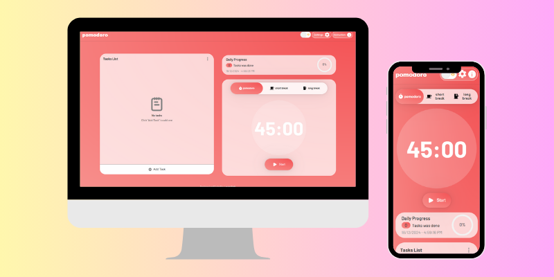
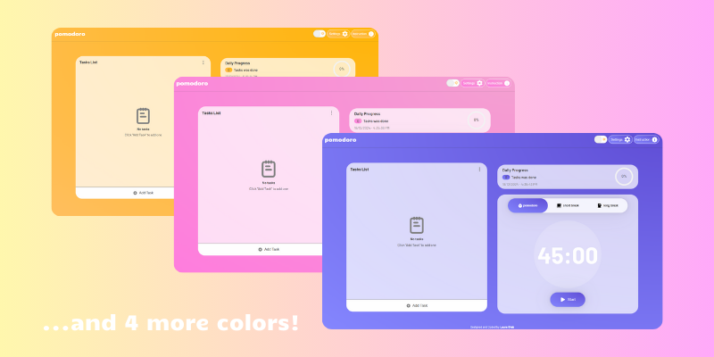
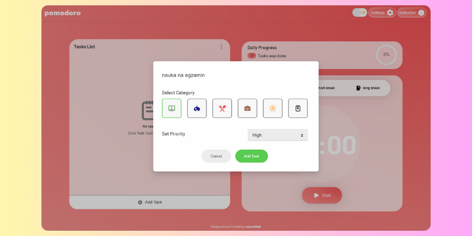
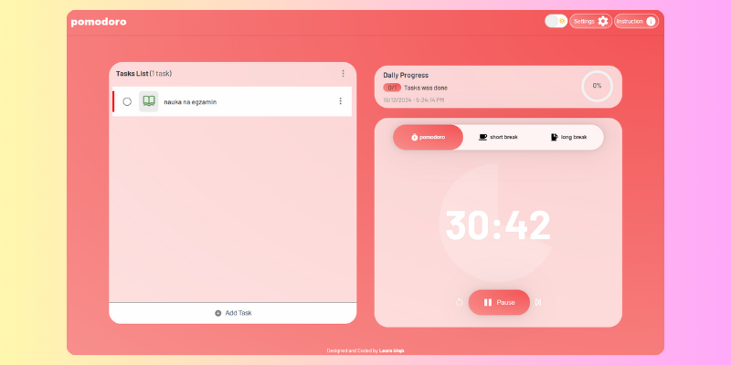
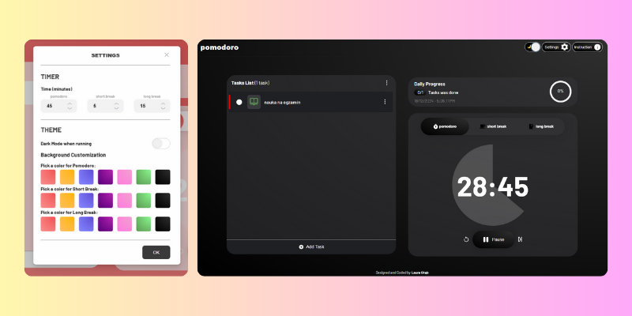
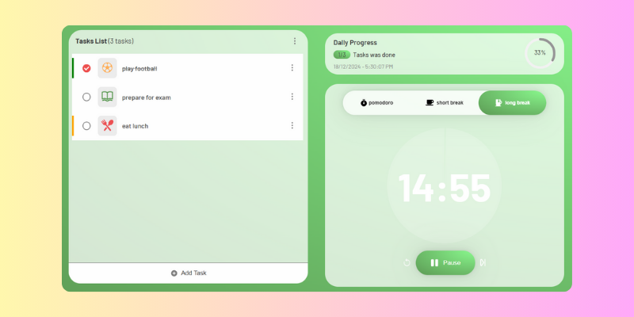

<h1 align="center">Pomodoro Productivity Tracker</h1>

  
  
Streamline your productivity and manage tasks efficiently with my advanced web-based <a href="https://your-website.com](https://pomodoro-productivity-tracker.vercel.app/" target="_blank" text-decoration="none">Pomodoro</a> tracker.

## Table of Contents
- [Introduction](#introduction)
- [Features](#features)
  - [Task Management](#task-management)
  - [Pomodoro Timer](#pomodoro-timer)
  - [Theming and Personalization](#theming-and-personalization)
  - [Additional Features](#additional-features)
- [Usage](#usage)
- [Project Screenshots](#project-screenshots)
- [Built with](#built-with)
- [License](#license)

## Introduction
Pomodoro Productivity Tracker is a comprehensive time management and task organization tool designed to enhance focus and productivity. Combining the Pomodoro technique with a flexible to-do list, this project helps users efficiently manage their time and tasks while offering customization options to suit individual preferences.

## Features

### Task Management:
- **Completion/Progress Bar:** Track your task completion at a glance.
- **Edit/Delete Tasks:** Modify or remove individual tasks or bulk delete completed or all tasks.
- **Drag-and-Drop Functionality:** Easily reorder tasks with intuitive drag-and-drop support.
- **Task Details Menu:** View additional details about each task.
- **Categorization:** Organize tasks by category for better management.

### Pomodoro Timer:
- **Dynamic Timer:** Switch between Pomodoro, short breaks, and long breaks.
- **Custom Time Settings:** Set your preferred duration for Pomodoro sessions and breaks.
- **Dark Mode When Active:** Automatically enable dark mode when the timer is running.

### Theming and Personalization:
- **Theme Customization:** Change the background color to your preferred shade.
- **Dark Theme:** Toggle dark mode for a better nighttime experience.

### Additional Features:
- **Dynamic Background Changes:** The background changes with each timer session.
- **Persistent Data Storage:** Tasks and preferences are saved using local storage.
- **Responsive design:** Ensures compatibility across desktop, tablet, and mobile platforms.

## Usage
1. Add tasks using the to-do list section and organize them by category.
2. Start the Pomodoro timer to begin focusing on tasks.
3. Use the theme customization and dark mode settings to tailor your workspace.
4. Track your progress through the completion bar and task details.

## Project Screenshots

  
  
  
  
  

## Built with:
- **React.js** - A JavaScript library for building user interfaces.
- **JavaScript (ES6+)** - For functionality and interactivity.
- **HTML5** - Structuring the content of the app.
- **CSS3** - Styling and layout.
- **Framer Motion** - For smooth animations and transitions.
- **LocalStorage** - To persist user data like tasks and settings.
- **Responsive Design Techniques** - Ensures usability across all devices and platforms.

## License
This project is licensed under the MIT License.

More info will be added soon.
